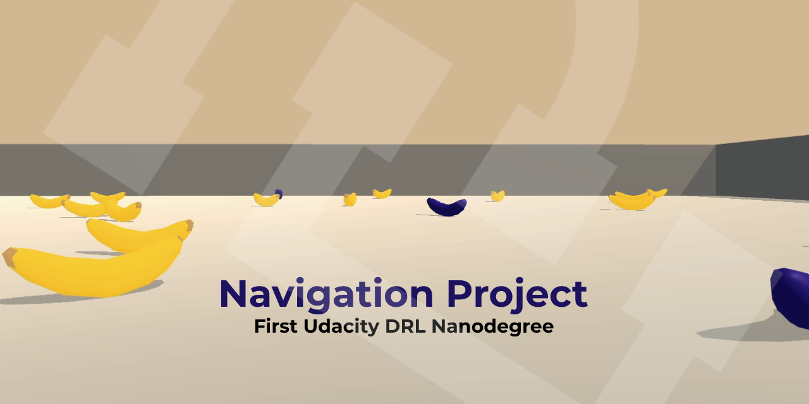

# Project 1: Navigation

 **Piero Macaluso** - [pieromacaluso](https://github.com/pieromacaluso)

- [Project 1: Navigation](#project-1-navigation)
  - [Introduction](#introduction)
    - [Environment Details](#environment-details)
  - [Getting Started](#getting-started)
    - [Environment Download and Setup](#environment-download-and-setup)
      - [Preamble](#preamble)
      - [Instruction](#instruction)
    - [How-to start the training of the agent](#how-to-start-the-training-of-the-agent)
    - [How-to test the agent](#how-to-test-the-agent)

## Introduction

This project is mainly focused on training an agent to navigate and collect bananas in a large square world.

This document is mainly focused on the description of the environment and how to setup the experiments.
Further information about the algorithm used to train the agent can be retrieved by reading the [`report.pdf`](report.pdf) document in the root of this repository

### Environment Details

The **state space** has 37 dimensions and contains the agent's velocity, along with ray-based perception of objects around agent's forward direction.

The agent has four discrete actions to select, corresponding to:
- **`0`** - move forward.
- **`1`** - move backward.
- **`2`** - turn left.
- **`3`** - turn right.

A reward of +1 is provided for collecting a yellow banana, and a reward of -1 is provided for collecting a blue banana. 
Thus, the goal of your agent is to collect as many yellow bananas as possible while avoiding blue bananas.

The task is episodic, the environment can be considered as solved when the agent reaches an average score of +13 over 100 consecutive episodes.

## Getting Started

### Environment Download and Setup

#### Preamble

The work in this repository has been tested on **Python 3.6.13**, by using [Poetry](https://python-poetry.org/), a tool for dependency management and packaging in Python.
However, it is possible to use virtualenv or other dependency management systems thanks to the presence of the `requirements.txt` file in the root folder.

#### Instruction

1. Download the environment from one of the links below.  You need only select the environment that matches your operating system:
   
    - Linux: [click here](https://s3-us-west-1.amazonaws.com/udacity-drlnd/P1/Banana/Banana_Linux.zip)
    - Mac OSX: [click here](https://s3-us-west-1.amazonaws.com/udacity-drlnd/P1/Banana/Banana.app.zip)
    - Windows (32-bit): [click here](https://s3-us-west-1.amazonaws.com/udacity-drlnd/P1/Banana/Banana_Windows_x86.zip)
    - Windows (64-bit): [click here](https://s3-us-west-1.amazonaws.com/udacity-drlnd/P1/Banana/Banana_Windows_x86_64.zip)
    
   > (_For Windows users_) Check out [this link](https://support.microsoft.com/en-us/help/827218/how-to-determine-whether-a-computer-is-running-a-32-bit-version-or-64) if you need help with determining if your computer is running a 32-bit version or 64-bit version of the Windows operating system.
   
2. Place the file in the root folder of this GitHub repository and decompress the file.
3. Two alternatives there:
   - **Poetry**: Run `poetry install` in the root directory.
   - **Other dependency management tools**: Install the requirements listed in the `requirements.txt` file.

### How-to start the training of the agent

To train the agent it is necessary to go to the root folder of the project and run `python train.py`.

The code will start to create checkpoints in the appropriate folder.

### How-to test the agent

The best parameters of the network found in the training are available in the file [checkpoint.pth](chackpoint.pth) in the root folder of this repository.

In order to test the network it is possible to go to the root folder and run `python test.py`